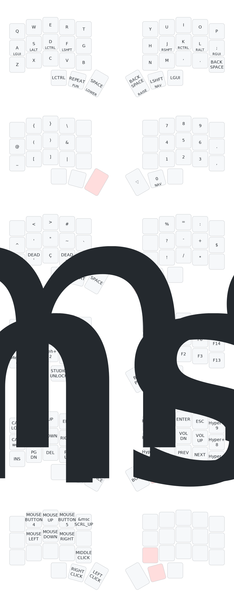

## Dactyl Cygnus

### A 36 keys handwired split keyboard.

### Build Details

Dactyl Cygnus is a handwired board originally designed by @juhakaup and available at [https://github.com/juhakaup/keyboards](https://github.com/juhakaup/keyboards).

This is a wireless version of this keyboard. All build details can be found in the designer's page.

### ZMK Studio

This board is compatible with [ZMK Studio](https://zmk.studio/). To live edit the keymap, connect the left side using a USB-C cable and follow the steps at https://zmk.studio.

## Resources

- [ZMK Docs](https://zmk.dev/docs)
- [Keyboard Tester](https://config.qmk.fm/#/test)
